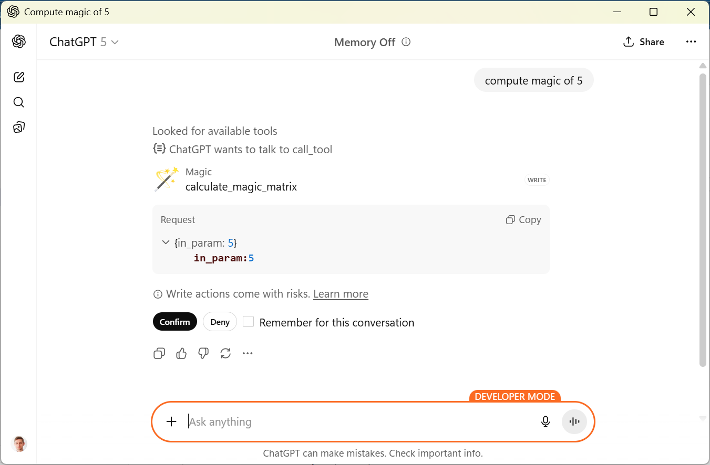
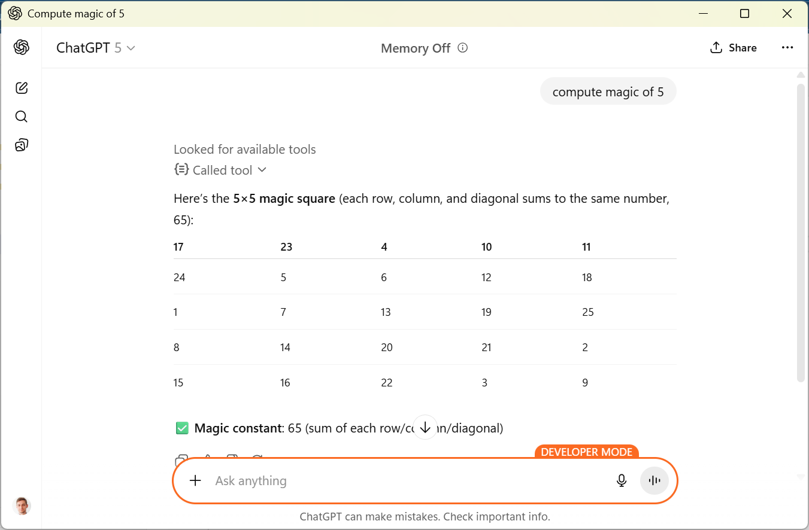
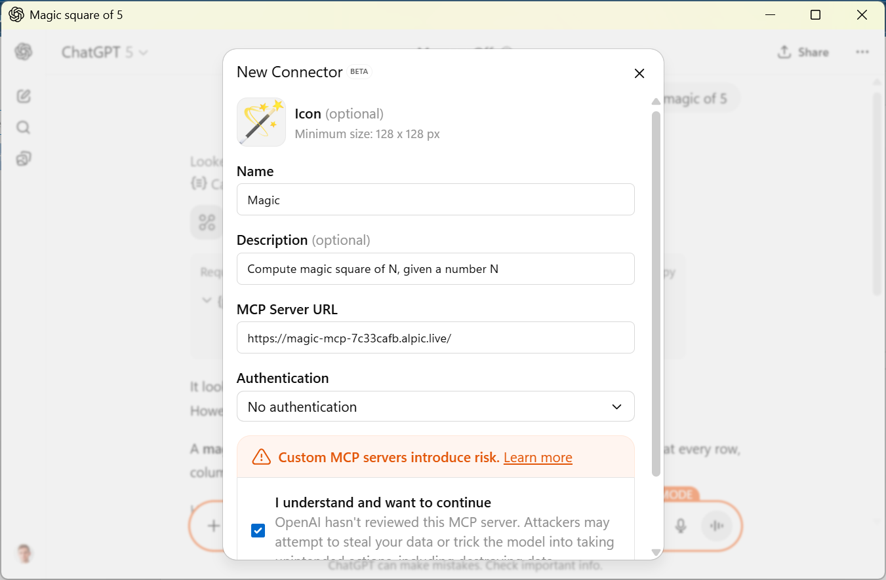
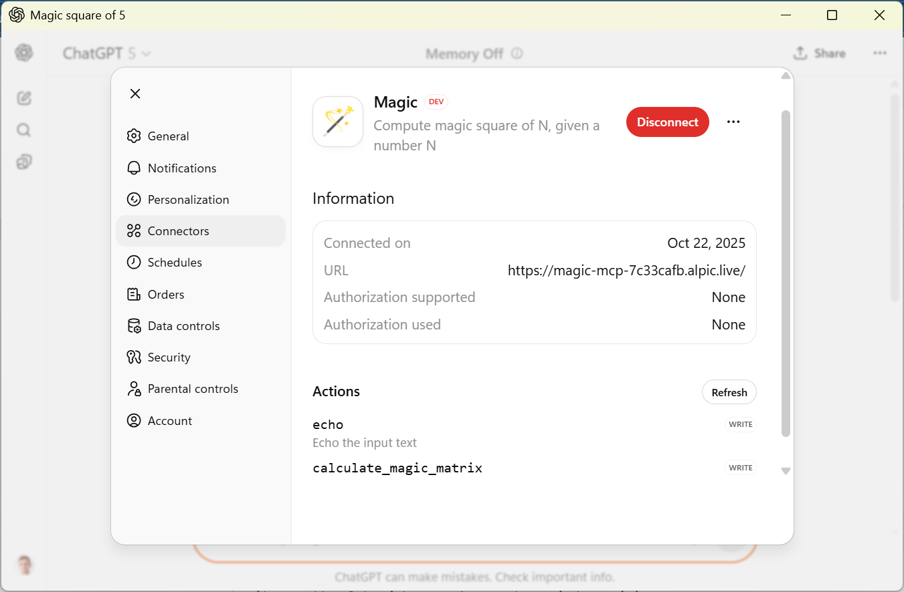

# Magic-MCP

Magic square function exposed as MCP server 🪄✨





## Getting started

1. Create a virtual environment and install the dependencies:

   ```bash
   python -m venv .venv
   source .venv/bin/activate
   pip install -r requirements.txt
   ```

2. Run the MCP server:

   ```bash
   python server.py
   ```

   The server exposes a single tool, `generate_magic_square`, which proxies a
   remote MATLAB service hosted at
   `https://matlab-0j1h.onrender.com/mymagic/mymagic`.

4. Dependencies

   This project now uses `requests` and `numpy` to call and parse the remote
   MATLAB service. Ensure those packages are installed (they're included in
   `requirements.txt`). To change the target MATLAB service URL, edit the
   `MATLAB_SERVICE_URL` variable inside the `calculate_magic_matrix` tool in
   `server.py`.

3. Connect an MCP-compatible client to the server (for example, via MCP
   discovery or by pointing the client at the stdio endpoint) and invoke the
   `generate_magic_square` tool. Provide the desired square size (and optionally
   set `debug=true`) to receive a structured response containing both the magic
   square and the raw metadata returned by the upstream service.


## ChatGPT connector Set-up




